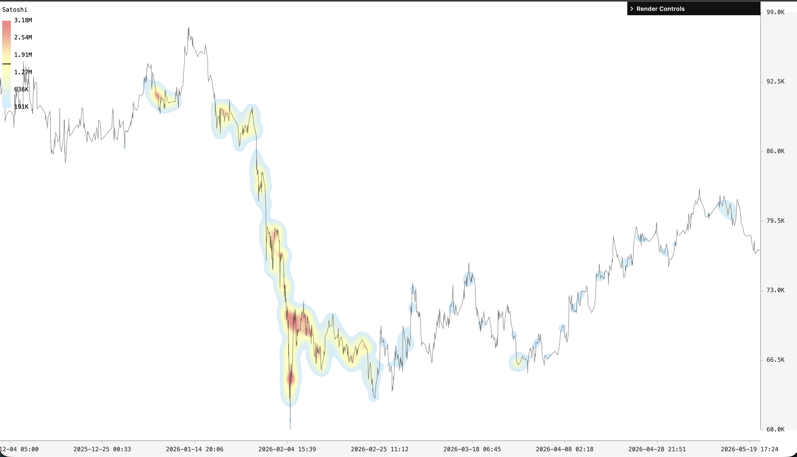

# GPU-Accelerated Density Heatmap Rendering for Large-Scale Financial Timeseries

**Abstract** — A timeseries is typically visualized as a two-dimensional line chart of time against value. When a third scalar dimension is available — such as traded volume at each price event — a line chart provides no means to encode it, and the information is lost. We present a pipeline that encodes this third dimension as a weighted Kernel Density Estimation (KDE) density field rendered as a heatmap, allowing all three dimensions to be read simultaneously from a single chart. At the scale of hundreds of thousands of points, neither CPU-based KDE nor a naïve GPU implementation achieves the frame budget required for real-time pan and zoom. We address this with a kernel-merging approximation that collapses spatially proximate points into single weighted kernels before GPU submission, reducing the number of kernel evaluations to screen resolution. The resulting three-stage pipeline — *accumulation*, *reduction*, and *tonemapping* — renders a perceptually calibrated density heatmap at interactive framerates with no server-side pre-aggregation.

---

## 1. Motivation

A timeseries associates two values — a timestamp and a measured quantity — and a line chart is the natural way to display that relationship. Many real-world timeseries carry a meaningful third scalar at each observation: traded volume in financial markets, signal amplitude in sensor data, event severity in telemetry. This third dimension cannot be encoded on a conventional line chart without resorting to separate panels or lossy aggregations such as bar charts, which break the continuity of the series.

Kernel Density Estimation offers a principled way to incorporate the third dimension. By treating each observation as a weighted Gaussian kernel placed at its (time, value) coordinates, the superposition of all kernels forms a continuous density field over the two-dimensional chart space. Regions where observations are dense and heavily weighted accumulate high density; sparse or lightly weighted regions accumulate little. Mapping this field to a colormap produces a heatmap that encodes all three dimensions simultaneously — time on the horizontal axis, value on the vertical axis, and the third scalar as color intensity.

The practical obstacle is scale. A single trading session for an active instrument routinely produces hundreds of thousands of tick events. Evaluating a Gaussian kernel for each point at each pixel on the CPU is computationally intractable for real-time interaction: the cost grows as O(N × W × H), where N is the point count and W × H is the screen resolution. Moving the kernel splatting to the GPU reduces constant factors substantially, but a naïve implementation — one draw call per point, each covering a kernel-sized screen region — still fails to meet the frame budget at this data scale when the view changes and all kernels must be re-evaluated.

Moving the kernel splatting to the GPU helps, but a naïve implementation still faces a severe overdraw problem. Each Gaussian kernel spans a screen-aligned quad whose area scales with the square of the kernel radius; a kernel of radius 50 pixels covers roughly 30,000 pixels, every one of which must be shaded and blended. With hundreds of thousands of kernels and significant spatial overlap between them, the total number of fragment shader invocations can reach into the billions per frame — well beyond what any GPU can sustain at interactive rates.

We address this with a *kernel-merging approximation*. Points that project within a configurable screen-space threshold of one another are collapsed into a single representative kernel whose weight is the sum of the constituent weights. Because the merge is performed in screen space and re-run on each view change, the number of kernels submitted to the GPU is bounded by the pixel resolution of the display rather than by the size of the dataset. The approximation error is negligible when the threshold is kept near the kernel radius: merged points are perceptually indistinguishable from the exact superposition of their individual kernels. The result is a three-stage GPU pipeline — *accumulation*, *reduction*, and *tonemapping* — that renders a perceptually calibrated density heatmap at interactive framerates across the full range of zoom levels.

---

## 2. Data Preparation

Each data point carries three values: a timestamp, a price level, and a scalar weight. For financial tick data, weight is naturally derived from traded volume — the sum of buy and sell quantities — making denser activity periods visually brighter regardless of the number of individual events.

Before rendering, timestamps are normalized to a unit interval. This ensures that coordinate arithmetic in subsequent stages operates on well-conditioned values regardless of the absolute time range, preventing precision loss under extreme zoom. The original scale factors are retained separately for axis label reconstruction.

---

## 3. Adaptive Downsampling

### 3.1 View-Range Clipping

Because data is sorted by time, only points falling within the current view window need to be considered. Binary search extracts this subset in logarithmic time, keeping all subsequent work proportional to visible data rather than total data.

### 3.2 Weighted Merge

The visible points are passed through a *weighted merge* downsampler before GPU upload. The algorithm scans points left to right, maintaining an open cluster. When a new point arrives, it computes the hypothetical weighted centroid that would result from absorbing the point into the cluster. If both the earliest cluster point and the incoming point remain within a configurable screen-space threshold of that centroid, the point is absorbed and the centroid is updated. Otherwise the cluster is flushed as a single output point and a new cluster begins.

The centroid of each output point carries the summed weight of all its constituents, conserving the total signal: a merged cluster renders with a proportionally brighter splat than any individual constituent would.

Checking the earliest cluster point — rather than just the current centroid — guards against gradual centroid drift, which would otherwise allow clusters to grow larger than the threshold over many small steps.

Because the data is sorted by the time axis, candidate neighbors for merging always arrive in order and a point can only join the current open cluster or trigger the start of a new one. No backtracking or reordering is needed, and each point is visited exactly once. The algorithm therefore runs in O(N) time over the visible subset, which is critical given that the merge must complete within a single frame budget to support smooth interaction.

Smooth pan and zoom are a first-class requirement of the system. As the user navigates, the set of visible points and their screen-space projections change continuously, so the merge is re-run on every view change. Abrupt discontinuities in the density field — caused by points entering or leaving the view, or by the merge threshold splitting or joining clusters differently — would produce jarring visual jumps that undermine the user's spatial intuition. The O(N) merge is fast enough to re-run each frame, ensuring that the heatmap evolves gradually as the view moves rather than snapping between discrete states.

### 3.3 Why Shape-Preserving Simplification Is Insufficient

Classical timeseries simplification algorithms such as Largest-Triangle-Three-Buckets (LTTB) and Ramer-Douglas-Peucker (RDP) are designed to preserve the visual shape of a line chart: they select or retain points whose positions best reconstruct the geometry of the original polyline, discarding points they deem geometrically redundant. This objective is appropriate for a line chart, where the eye follows the trajectory of the series. It is, however, the wrong objective for KDE.

In a density heatmap the quantity that must be conserved is the total weight — the accumulated momentum of the signal — not its geometric shape. A point that is geometrically redundant (lying close to a chord between its neighbors) may nonetheless carry substantial weight that, if discarded, would leave the density field darker than the data warrants. Conversely, a point selected by LTTB because it lies far from the chord may carry negligible weight, contributing little to the density while consuming a kernel evaluation. Both cases produce a density estimate that misrepresents the underlying distribution.

The weighted merge strategy addresses this directly: the sole criterion for collapsing points is screen-space proximity, and the total weight is always conserved in the merged centroid. No information about the magnitude of the signal is lost, only spatial resolution that is already below the pixel threshold and therefore invisible.

---

## 4. GPU Rendering Pipeline

The rendering pipeline consists of three GPU passes submitted together per frame.

### 4.1 Pass 1 — Accumulation

The first pass performs Kernel Density Estimation (KDE) directly on the GPU. Each downsampled point is rendered as a small screen-aligned quad that splatts a Gaussian kernel onto a high-dynamic-range (HDR) floating-point texture using additive blending. Because each fragment simply adds its contribution to the running sum, no explicit synchronization is needed: hardware blending accumulates the KDE density field correctly even when kernels overlap.

The kernel radius is configurable in screen pixels. The quad is sized to cover the full extent of the kernel — three standard deviations in each direction — so that effectively all of the kernel mass is captured. Inside the quad, each fragment evaluates the Gaussian as a function of its distance from the point center, scaled by the point's weight. Points outside the current view window are discarded before reaching the rasterizer.

A small padding margin is reserved at the top and bottom of the heatmap region so that density does not bleed into the axis areas.

### 4.2 Pass 2 — Reduction

The second pass finds the maximum accumulated value across the entire HDR texture. A parallel reduction — dispatched across the texture in tiles — scans every texel and records the global maximum via an atomic operation.

This maximum is read back to the CPU asynchronously for use in the legend scale. Because the readback is asynchronous it introduces at most one frame of lag, which is imperceptible in practice. More importantly, the value is available to the tonemapping pass in the same frame via the same GPU-side buffer, so normalization is always current.

### 4.3 Pass 3 — Tonemapping

The third pass maps the raw floating-point accumulation values to a perceptual colormap and writes the final output. A fullscreen quad reads from the HDR texture and the maximum value buffer, normalizing each pixel's density to the range `[0, 1]`.

Pixels below a configurable opacity threshold are rendered fully transparent, hiding empty or near-empty regions and separating signal from background cleanly.

The normalized value is then mapped through a three-stop colormap with a user-adjustable midpoint. The fragment shader interpolates the color gradient from a low-density color through a mid-density color to a high-density color. The midpoint position controls where the perceptual emphasis of the colormap sits: pulling it toward zero compresses the high end and reveals fine structure in sparse regions; pushing it toward one stretches the low end and emphasizes the densest concentrations.

An optional quantization step maps the normalized value to a discrete number of levels before color lookup, producing a contour-map aesthetic that can make density gradients easier to read.

---

## 5. Discussion

### 5.1 Complexity

Per-frame CPU work is linear in the number of visible points and runs in a single pass. GPU work for the accumulation pass scales with the number of downsampled points and the kernel radius; the reduction and tonemapping passes scale with screen resolution. In practice the downsampling limits the GPU instance count to a few thousand even for datasets with hundreds of thousands of points, making the accumulation pass fast relative to the fixed-cost passes.

### 5.2 Limitations

The technique requires a GPU that supports floating-point render target formats with additive blending. This is widely supported on desktop hardware but may not be available on all mobile devices.

At very high zoom levels — sub-millisecond time windows for tick data — the view contains so few points that the density field degenerates into isolated splats, and the heatmap character of the visualization disappears. At that scale a plain line or scatter chart is more appropriate.

The colormap is defined in display color space, while kernel accumulation operates in linear space. For saturated color palettes this can produce a minor perceptual inconsistency that would be corrected by linearizing the palette entries before upload.

### 5.3 Future Work

The shape-preserving downsampling strategies (LTTB, RDP) could drive a dedicated line chart pass in parallel with the density heatmap, providing a geometrically accurate price trace without inflating kernel weights. Combining both representations in the same view would make the relationship between price trajectory and activity density immediately readable.

---

## 6. Conclusion

We described an interactive density heatmap pipeline for weighted timeseries data. The central insight is that three GPU passes — additive Gaussian accumulation onto a floating-point texture, parallel max-reduction for dynamic range normalization, and perceptual tonemapping with a tunable colormap — are sufficient to render a fully interactive density visualization at the scale of financial tick data. Adaptive weighted-merge downsampling prior to each frame bounds the GPU work to screen resolution, ensuring performance scales with visible data rather than total data.

